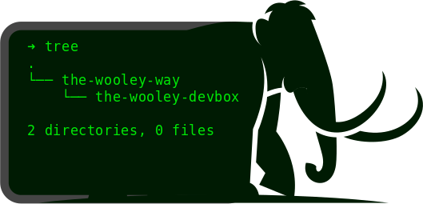

# The Wooley Dev Box

## What is this repository?
This repository is the source code for the posts:
> DIV and Backend again. A TypeScript Tale

## Organization and posts
The repository is organized into branches. One for each post.
 - Part 1: Setting Up NX
   - [Branch](https://github.com/ericwooley/the-wooley-dev-box/tree/setup-nx)
   - Post (not yet published)
 - Part 2: Setting Up Type Graphql
   - [Branch](https://github.com/ericwooley/the-wooley-dev-box/tree/Type-Graphql)
   - Post (not yet published)
 - Part 3: Setting Up TypeORM
   - [Branch](https://github.com/ericwooley/the-wooley-dev-box/tree/typeorm)
   - Post (not yet published)
 - Part 4: Setting Up Graphql Code Generation
   - [Branch](https://github.com/ericwooley/the-wooley-dev-box/tree/graphql-code-gen)
   - Post (not yet published)
 - Part 5: Tying up up loose ends.
   - [Branch without styling added](https://github.com/ericwooley/the-wooley-dev-box/tree/tying-it-all-together)
   - Post (not yet published)
   - [Branch with styling added](https://github.com/ericwooley/the-wooley-dev-box/tree/finished-with-styles)
